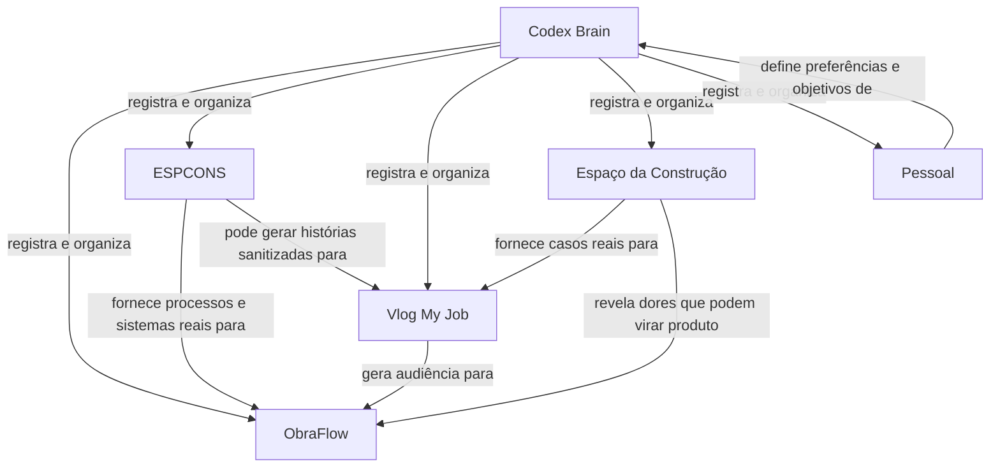

# Relações Entre Projetos

Este arquivo é a visão humana do grafo.

O arquivo estruturado para agentes é `relations.yml`.

## Mapa Inicial

## Leitura Rápida

- Vlog My Job é distribuição e audiência.
- ObraFlow é produto.
- ESPCONS é operação e sistemas reais.
- Espaço da Construção é experiência prática e casos do setor.
- Pessoal é contexto de Matheus, sensível por padrão.
- Codex Brain é o mapa que ajuda a IA a escolher contexto sem carregar tudo.

## Regra Do Grafo

Uma relação deve ser curta, verificável e útil para ação.

Exemplo bom:

`Vlog My Job -> gera audiência para -> ObraFlow`

Exemplo ruim:

`Tudo se conecta com tudo`
